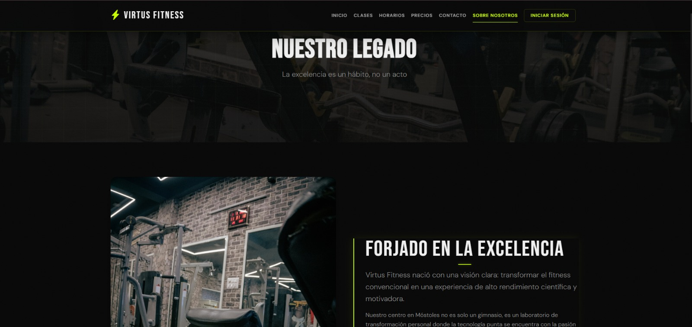
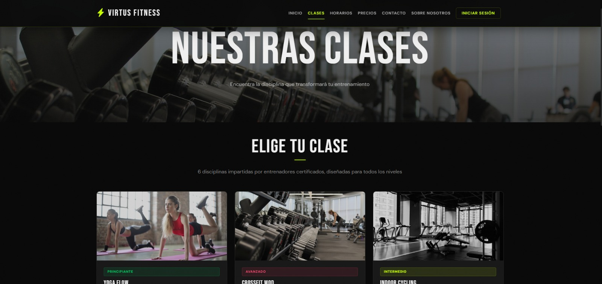
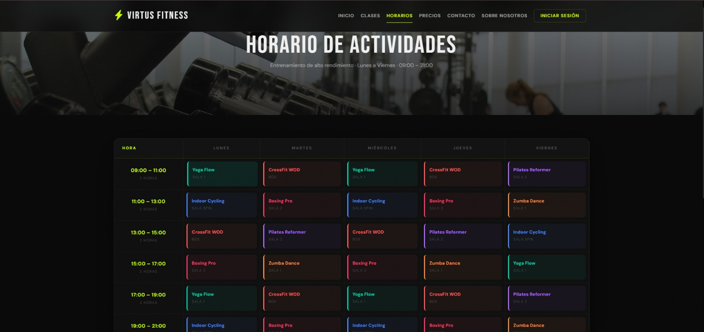
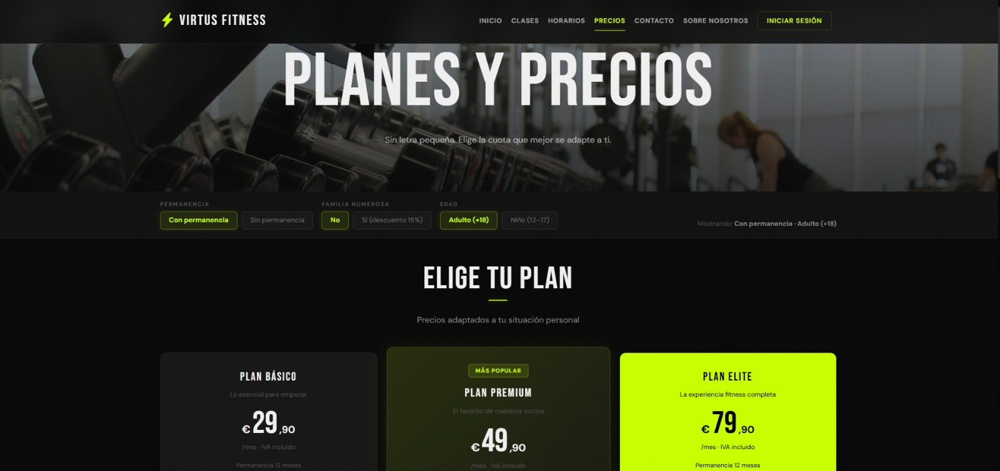
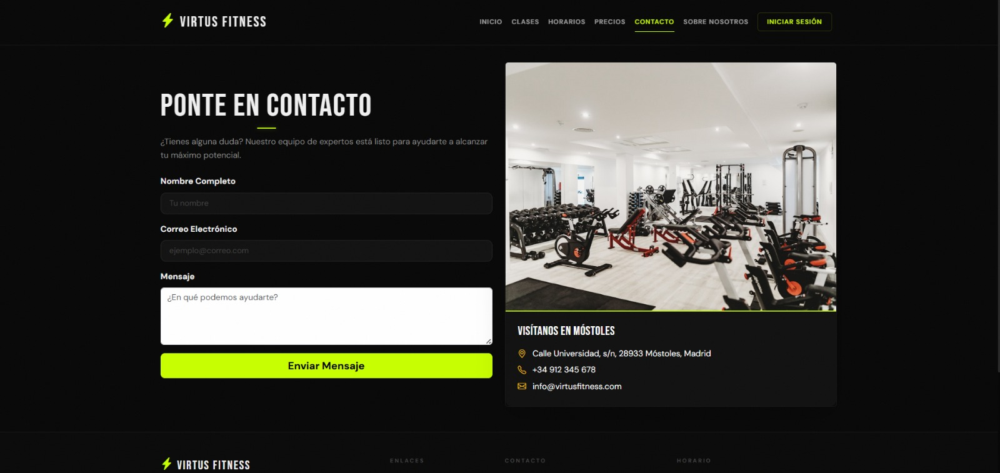
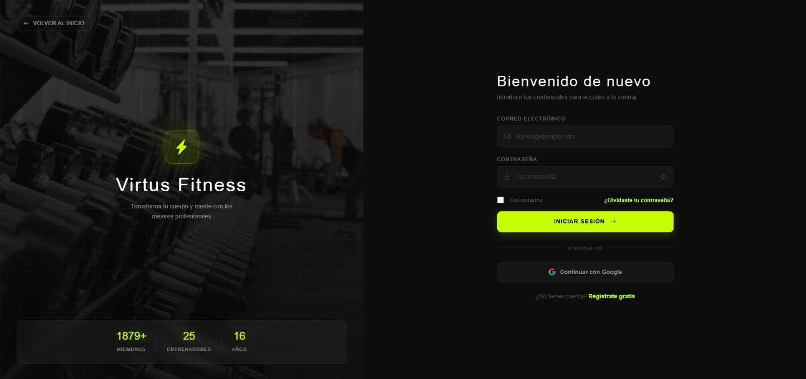
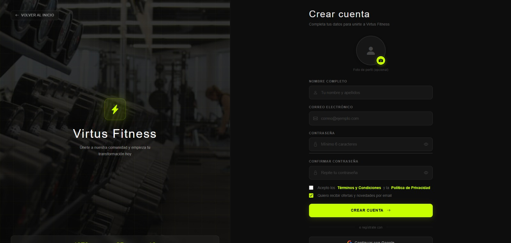
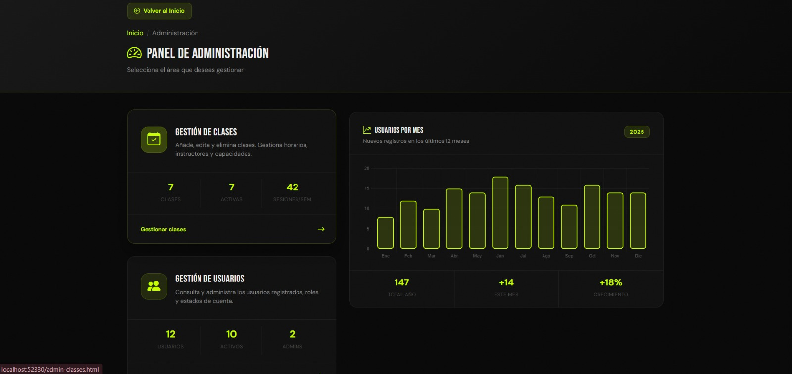
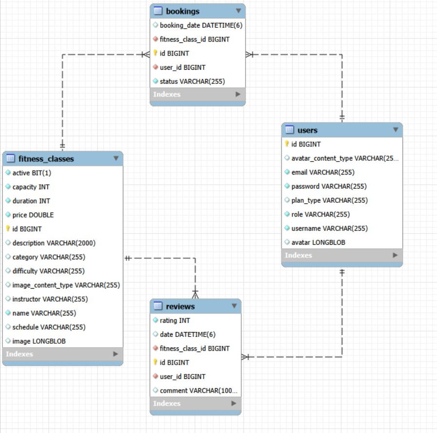
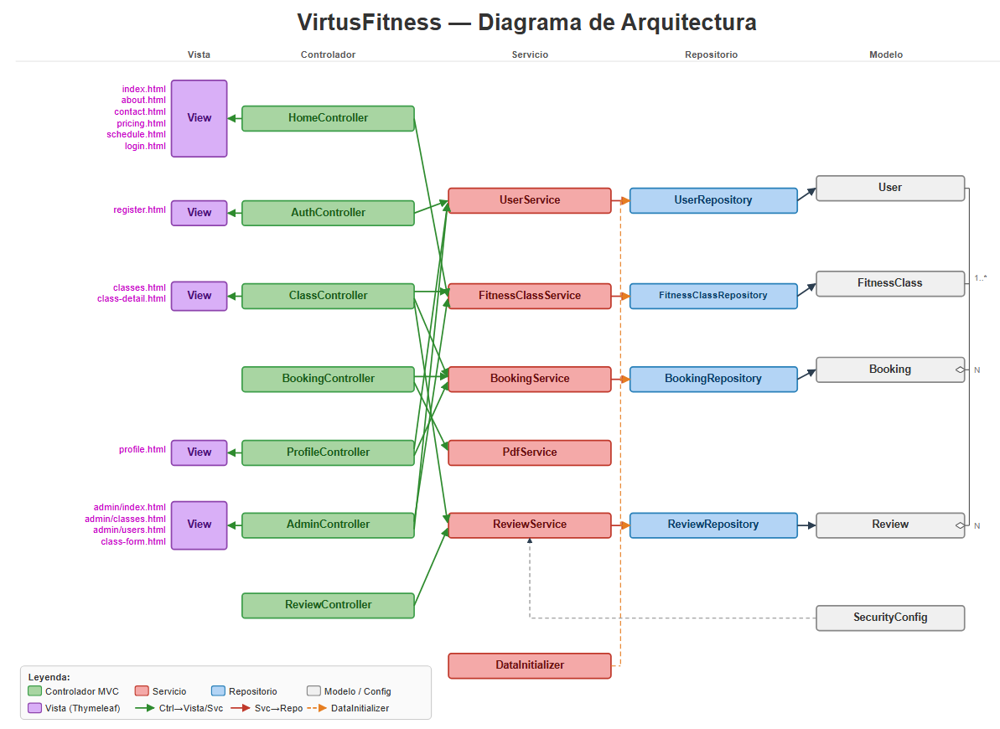

# Virtus Fitness - Gym Management System

## 👥 Team Members
| Name and Surnames | URJC Email | GitHub Username |
|:--- |:--- |:--- |
| Jorge Rodríguez Lázaro | j.rodriguezl.2023@alumnos.urjc.es | jorgeRL05 |
| Miguel Rey Carballo | m.rey.2024@alumnos.urjc.es | Miguelreey |
| Pablo Valdés Colomo | p.valdes.2023@alumnos.urjc.es | Pablo Colomo |

---

## 🎭 **Preparation: Project Definition**

### **Theme Description**
Virtus Fitness is a comprehensive management platform for sports centers and high-performance gyms. It belongs to the health and wellness sector. The primary value it provides is the ability for users to self-manage their training through class bookings and access to personalized training plans, facilitating organization for both the client and the center administrator.

### **Entities**
The following are the 4 main entities managed by the application and their relationships:

1. **User (Usuario)**: Manages credentials, profile data, and access roles.
2. **Workout Class (Clase)**: Represents the sessions offered (e.g., CrossFit, Yoga), including description and capacity.
3. **Booking (Reserva)**: An entity that links a User with a specific Class.
4. **Class Coment(Comentario de clase)**: Allows a User to leave a comment or feedback on a specific Class, enabling users to share their experience or opinion about the session.

**Relationships between entities:**
- **User - Booking**: A user can have multiple bookings for different classes (1:N).
- **Workout Class - Booking**: A class can have multiple bookings from different users until capacity is reached (1:N).
- **User - Training Plan**: A registered user has a personalized plan assigned, and each plan belongs to one user (1:1).
- **Admin - Class/Plan**: The administrator manages (CRUD) all classes and training plans.

### **User Permissions**
Description of the permissions for each user type and their data ownership:

* **Anonymous User**: 
  - Permissions: Browsing the class catalog, viewing schedules, and registration.
  - Ownership: Does not own any entity.

* **Registered User**: 
  - Permissions: Profile management, class booking/cancellation, and viewing assigned training plans.
  - Ownership: Owns their own **Bookings** and their **User Profile**.

* **Administrator**: 
  - Permissions: Full management of classes, users, and training plans (CRUD). Access to global statistics.
  - Ownership: Owns the **Workout Classes** and **Training Plans** within the system.

### **Images**
Entities that will have one or more associated images:

- **User**: One profile image (avatar) per user.
- **Workout Class**: Descriptive images for each activity type.
- **Training Plan**: Illustrative icons for the different types of routines.

### **Charts**
Information to be displayed using charts:
- **Chart**: New User Growth - Line Chart (for administrative use).

### **Complementary Technology**
Complementary technology to be implemented:

- **PDF Generation**: The system will use the **iText** library to automatically generate booking receipts in PDF format for users.

### **Advanced Algorithm or Query**
Advanced functionality to be implemented:

- **Algorithm/Query**: Dynamic Capacity Management and Waiting List Priority.
- **Description**: A real-time algorithm that validates class capacity. If full, it manages a waiting list prioritizing users based on their seniority and previous attendance rate.

---

## 🛠 **Part 1: Web Layout with HTML and CSS**

### **Navigation Diagram**


> Anonymous users can access public areas, while registered users gain access to their personal dashboard and booking management after logging in.

### **Screenshots and Page Descriptions**

#### **1. Home Page**


> Main landing page of Virtus Fitness where users can discover the gym, view featured training classes and quickly access login or registration to start booking sessions.


#### **2. About Page**



> Informational page describing Virtus Fitness, its philosophy, training approach and mission of promoting a healthy and active lifestyle through structured workouts.


#### **3. Classes Page**



> Page displaying all the available training classes offered by Virtus Fitness, allowing users to explore different workouts such as strength, cardio or functional training.


#### **4. Schedule Page**



> Weekly timetable showing when each training class takes place, helping users easily plan their workouts and select the sessions that best fit their availability.


#### **5. Prices Page**



> Page presenting the membership plans and pricing options available at Virtus Fitness, allowing users to compare subscriptions and choose the one that suits their training needs.


#### **6. Contact Page**



> Contact page where users can send inquiries to the Virtus Fitness team through a form and access essential information about the gym and its services.


#### **7. Login Page**



> Secure authentication page where registered users can log into their Virtus Fitness account to access the platform and manage their class bookings.


#### **8. Register Page**



> Registration page allowing new users to create a Virtus Fitness account in order to book classes, manage their schedule and access gym services online.


#### **9. Admin Page**



> Main administration dashboard providing an overview of the system, where administrators can monitor activity and manage the platform’s core functionalities.


#### **10. Admin Classes Page**


> Administrative interface used to manage gym classes, allowing administrators to create, edit or remove training sessions available to users.


#### **11. Admin Users Page**


> Administration panel section dedicated to user management, where administrators can view registered members and control access to the platform.


### **Member Participation in Part 1**

#### **Jorge Rodríguez Lázaro**
Developed HTML and CSS layouts for the "About Us" and "Schedules" pages.
| No. | Commits | Files |
|:---:|:---:|:---:|
| 1 | [Add about.html with initial content](https://github.com/CodeURJC-SSDD-2025-26/practica-ssdd-2025-26-grupo-8/commit/c24f26625f17fe8ea97d6fd00f3484b42c5fc41e) | [about.html](https://github.com/CodeURJC-SSDD-2025-26/practica-ssdd-2025-26-grupo-8/blob/main/about.html) |
| 2 | [Refactor schedule.html structure and add styles](https://github.com/CodeURJC-SSDD-2025-26/practica-ssdd-2025-26-grupo-8/commit/96bc8b9a8f3cbbe10e6d47b3c019b708e1df2e85) | [schedule.html](https://github.com/CodeURJC-SSDD-2025-26/practica-ssdd-2025-26-grupo-8/blob/main/schedule.html) |
| 3 | [Add files via upload (about.css)](https://github.com/CodeURJC-SSDD-2025-26/practica-ssdd-2025-26-grupo-8/commit/99eaa6ea1bfc2c35004c377586ab74e259e0fee5) | [[assets/img/](https://github.com/CodeURJC-SSDD-2025-26/practica-ssdd-2025-26-grupo-8/tree/main/assets/img](https://github.com/CodeURJC-SSDD-2025-26/practica-ssdd-2025-26-grupo-8/blob/main/css/about.css) |
| 4 | [Add files via upload (schedule.css)](https://github.com/CodeURJC-SSDD-2025-26/practica-ssdd-2025-26-grupo-8/commit/e4e7744129dfb48e6b282798908a8fbcdb51f49c) | [[assets/img/](https://github.com/CodeURJC-SSDD-2025-26/practica-ssdd-2025-26-grupo-8/tree/main/assets/img](https://github.com/CodeURJC-SSDD-2025-26/practica-ssdd-2025-26-grupo-8/blob/main/css/schedule.css) |
| 5 | [Add navbar, hero section, and footer to about.html](https://github.com/CodeURJC-SSDD-2025-26/practica-ssdd-2025-26-grupo-8/commit/64c92fbfa36aa9c401d75919866c32d0b1bf9eaa) | [about.html](https://github.com/CodeURJC-SSDD-2025-26/practica-ssdd-2025-26-grupo-8/blob/main/about.html) |
| 6 | [Add schedule layout and activity details](https://github.com/CodeURJC-SSDD-2025-26/practica-ssdd-2025-26-grupo-8/commit/968c2857dbb0fa7720567b9330e7c6e17fa8e3f3) | [schedule.html](https://github.com/CodeURJC-SSDD-2025-26/practica-ssdd-2025-26-grupo-8/blob/main/schedule.html) |

---

#### **Miguel Rey Carballo**
Responsible for user profile design and navigation logic between roles.

| No. | Commits | Files |
|:---:|:---:|:---:|
| 1 | [complete redesign of the main page](https://github.com/CodeURJC-SSDD-2025-26/practica-ssdd-2025-26-grupo-8/commit/5114ec5982d8a0db33e2ca087336a11e5fcc0270) | [index.html](https://github.com/CodeURJC-SSDD-2025-26/practica-ssdd-2025-26-grupo-8/blob/main/index.html) |
| 2 | [complete redesign of global stylesheet](https://github.com/CodeURJC-SSDD-2025-26/practica-ssdd-2025-26-grupo-8/commit/5114ec5982d8a0db33e2ca087336a11e5fcc0270) | [styles.css](https://github.com/CodeURJC-SSDD-2025-26/practica-ssdd-2025-26-grupo-8/blob/main/css/styles.css) |
| 3 | [complete rewrite of main JavaScript file](https://github.com/CodeURJC-SSDD-2025-26/practica-ssdd-2025-26-grupo-8/commit/8728afb75e927b44846aaacbee8d20497cd9d04e) | [main.js](https://github.com/CodeURJC-SSDD-2025-26/practica-ssdd-2025-26-grupo-8/blob/main/js/main.js) |
| 4 | [created register dedicated page](https://github.com/CodeURJC-SSDD-2025-26/practica-ssdd-2025-26-grupo-8/commit/933b4568df652ded982bccdaaa8e8b7a2c22bcb0) | [register.html](https://github.com/CodeURJC-SSDD-2025-26/practica-ssdd-2025-26-grupo-8/blob/main/register.html) |
| 5 | [created register dedicated page](https://github.com/CodeURJC-SSDD-2025-26/practica-ssdd-2025-26-grupo-8/commit/933b4568df652ded982bccdaaa8e8b7a2c22bcb0) | [login.html](https://github.com/CodeURJC-SSDD-2025-26/practica-ssdd-2025-26-grupo-8/blob/main/login.html) |
| 6 | [created register dedicated js](https://github.com/CodeURJC-SSDD-2025-26/practica-ssdd-2025-26-grupo-8/commit/6b285e02a628e7d6ed9aa29b12b4118c1b88d646) | [register.js](https://github.com/CodeURJC-SSDD-2025-26/practica-ssdd-2025-26-grupo-8/blob/main/js/register.js) |
| 7 | [created login dedicated js](https://github.com/CodeURJC-SSDD-2025-26/practica-ssdd-2025-26-grupo-8/commit/6b285e02a628e7d6ed9aa29b12b4118c1b88d646) | [login.js](https://github.com/CodeURJC-SSDD-2025-26/practica-ssdd-2025-26-grupo-8/blob/main/js/login.js) |

#### **Pablo Valdés Colomo**
Responsible for administrative dashboard layouts and chart system design.

| No. | Commits | Files |
|:---:|:---:|:---:|
| 1 | [Add complete classes.html page structure and content](https://github.com/CodeURJC-SSDD-2025-26/ssdd-2025-26-project-base/commit/7ed1164a301a90f775e6b8e21fa6218016345eae) | [classes.html](https://github.com/CodeURJC-SSDD-2025-26/practica-ssdd-2025-26-grupo-8/blob/main/classes.html) |
| 2 | [Add styles for classes page](https://github.com/CodeURJC-SSDD-2025-26/ssdd-2025-26-project-base/commit/28e1d5caef456527a8741047847c6ef2d87ccc41) | [classes.css](https://github.com/CodeURJC-SSDD-2025-26/practica-ssdd-2025-26-grupo-8/blob/main/css/classes.css) |
| 3 | [Add classes.js with page-specific functionality](https://github.com/CodeURJC-SSDD-2025-26/ssdd-2025-26-project-base/commit/c5ead0ceea4f79608a431717cdabf854c18cec12) | [classes.js](https://github.com/CodeURJC-SSDD-2025-26/practica-ssdd-2025-26-grupo-8/blob/main/js/classes.js) |
| 4 | [Implement boxeo.html page structure](https://github.com/CodeURJC-SSDD-2025-26/ssdd-2025-26-project-base/commit/d11ca8fdfecd25a1df80964e4cc51a124792a810) | [boxeo.html](https://github.com/CodeURJC-SSDD-2025-26/practica-ssdd-2025-26-grupo-8/blob/main/boxeo.html) |
| 5 | [Add pricing.html page](https://github.com/CodeURJC-SSDD-2025-26/ssdd-2025-26-project-base/commit/c5ead0ceea4f79608a431717cdabf854c18cec12) | [pricing.html](https://github.com/CodeURJC-SSDD-2025-26/practica-ssdd-2025-26-grupo-8/blob/main/pricing.html) |

## 🛠 **Práctica 2: Web con HTML generado en servidor**

### **Navegación y Capturas de Pantalla**

#### **Diagrama de Navegación**

Solo si ha cambiado.

#### **Capturas de Pantalla Actualizadas**

Solo si han cambiado.

### **Instrucciones de Ejecución**

#### **Requisitos Previos**
- **Java**: versión 21 o superior
- **Maven**: versión 3.8 o superior
- **MySQL**: versión 8.0 o superior
- **Git**: para clonar el repositorio

#### **Pasos para ejecutar la aplicación**

1. **Clonar el repositorio**
   ```bash
   git clone https://github.com/[usuario]/[nombre-repositorio].git
   cd [nombre-repositorio]
   ```

2. **AQUÍ INDICAR LO SIGUIENTES PASOS**

#### **Credenciales de prueba**
- **Usuario Admin**: usuario: `admin`, contraseña: `admin`
- **Usuario Registrado**: usuario: `user`, contraseña: `user`

### **Diagrama de Entidades de Base de Datos**

Diagrama mostrando las entidades, sus campos y relaciones:



> [Descripción opcional: Ej: "El diagrama muestra las 4 entidades principales: Usuario, Producto, Pedido y Categoría, con sus respectivos atributos y relaciones 1:N y N:M."]

### **Diagrama de Clases y Templates**

Diagrama de clases de la aplicación con diferenciación por colores o secciones:



> [Descripción opcional del diagrama y relaciones principales]

### **Participación de Miembros en la Práctica 2**

#### **Alumno 1 - [Nombre Completo]**

[Descripción de las tareas y responsabilidades principales del alumno en el proyecto]

| Nº    | Commits      | Files      |
|:------------: |:------------:| :------------:|
|1| [Descripción commit 1](URL_commit_1)  | [Archivo1](URL_archivo_1)   |
|2| [Descripción commit 2](URL_commit_2)  | [Archivo2](URL_archivo_2)   |
|3| [Descripción commit 3](URL_commit_3)  | [Archivo3](URL_archivo_3)   |
|4| [Descripción commit 4](URL_commit_4)  | [Archivo4](URL_archivo_4)   |
|5| [Descripción commit 5](URL_commit_5)  | [Archivo5](URL_archivo_5)   |

---

#### **Alumno 2 - [Nombre Completo]**

[Descripción de las tareas y responsabilidades principales del alumno en el proyecto]

| Nº    | Commits      | Files      |
|:------------: |:------------:| :------------:|
|1| [Descripción commit 1](URL_commit_1)  | [Archivo1](URL_archivo_1)   |
|2| [Descripción commit 2](URL_commit_2)  | [Archivo2](URL_archivo_2)   |
|3| [Descripción commit 3](URL_commit_3)  | [Archivo3](URL_archivo_3)   |
|4| [Descripción commit 4](URL_commit_4)  | [Archivo4](URL_archivo_4)   |
|5| [Descripción commit 5](URL_commit_5)  | [Archivo5](URL_archivo_5)   |

---

#### **Alumno 3 - [Nombre Completo]**

[Descripción de las tareas y responsabilidades principales del alumno en el proyecto]

| Nº    | Commits      | Files      |
|:------------: |:------------:| :------------:|
|1| [Descripción commit 1](URL_commit_1)  | [Archivo1](URL_archivo_1)   |
|2| [Descripción commit 2](URL_commit_2)  | [Archivo2](URL_archivo_2)   |
|3| [Descripción commit 3](URL_commit_3)  | [Archivo3](URL_archivo_3)   |
|4| [Descripción commit 4](URL_commit_4)  | [Archivo4](URL_archivo_4)   |
|5| [Descripción commit 5](URL_commit_5)  | [Archivo5](URL_archivo_5)   |

---

#### **Alumno 4 - [Nombre Completo]**

[Descripción de las tareas y responsabilidades principales del alumno en el proyecto]

| Nº    | Commits      | Files      |
|:------------: |:------------:| :------------:|
|1| [Descripción commit 1](URL_commit_1)  | [Archivo1](URL_archivo_1)   |
|2| [Descripción commit 2](URL_commit_2)  | [Archivo2](URL_archivo_2)   |
|3| [Descripción commit 3](URL_commit_3)  | [Archivo3](URL_archivo_3)   |
|4| [Descripción commit 4](URL_commit_4)  | [Archivo4](URL_archivo_4)   |
|5| [Descripción commit 5](URL_commit_5)  | [Archivo5](URL_archivo_5)   |

---

## 🛠 **Práctica 3: API REST, docker y despliegue**

### **Documentación de la API REST**

#### **Especificación OpenAPI**
📄 **[Especificación OpenAPI (YAML)](/api-docs/api-docs.yaml)**

#### **Documentación HTML**
📖 **[Documentación API REST (HTML)](https://raw.githack.com/[usuario]/[repositorio]/main/api-docs/api-docs.html)**

> La documentación de la API REST se encuentra en la carpeta `/api-docs` del repositorio. Se ha generado automáticamente con SpringDoc a partir de las anotaciones en el código Java.

### **Diagrama de Clases y Templates Actualizado**

Diagrama actualizado incluyendo los @RestController y su relación con los @Service compartidos:


### **Instrucciones de Ejecución con Docker**

#### **Requisitos previos:**
- Docker instalado (versión 20.10 o superior)
- Docker Compose instalado (versión 2.0 o superior)

#### **Pasos para ejecutar con docker-compose:**

1. **Clonar el repositorio** (si no lo has hecho ya):
   ```bash
   git clone https://github.com/[usuario]/[repositorio].git
   cd [repositorio]
   ```

2. **AQUÍ LOS SIGUIENTES PASOS**:

### **Construcción de la Imagen Docker**

#### **Requisitos:**
- Docker instalado en el sistema

#### **Pasos para construir y publicar la imagen:**

1. **Navegar al directorio de Docker**:
   ```bash
   cd docker
   ```

2. **AQUÍ LOS SIGUIENTES PASOS**

### **Despliegue en Máquina Virtual**

#### **Requisitos:**
- Acceso a la máquina virtual (SSH)
- Clave privada para autenticación
- Conexión a la red correspondiente o VPN configurada

#### **Pasos para desplegar:**

1. **Conectar a la máquina virtual**:
   ```bash
   ssh -i [ruta/a/clave.key] [usuario]@[IP-o-dominio-VM]
   ```
   
   Ejemplo:
   ```bash
   ssh -i ssh-keys/app.key vmuser@10.100.139.XXX
   ```

2. **AQUÍ LOS SIGUIENTES PASOS**:

### **URL de la Aplicación Desplegada**

🌐 **URL de acceso**: `https://[nombre-app].etsii.urjc.es:8443`

#### **Credenciales de Usuarios de Ejemplo**

| Rol | Usuario | Contraseña |
|:---|:---|:---|
| Administrador | admin | admin123 |
| Usuario Registrado | user1 | user123 |
| Usuario Registrado | user2 | user123 |

### **OTRA DOCUMENTACIÓN ADICIONAL REQUERIDA EN LA PRÁCTICA**

### **Participación de Miembros en la Práctica 3**

#### **Alumno 1 - [Nombre Completo]**

[Descripción de las tareas y responsabilidades principales del alumno en el proyecto]

| Nº    | Commits      | Files      |
|:------------: |:------------:| :------------:|
|1| [Descripción commit 1](URL_commit_1)  | [Archivo1](URL_archivo_1)   |
|2| [Descripción commit 2](URL_commit_2)  | [Archivo2](URL_archivo_2)   |
|3| [Descripción commit 3](URL_commit_3)  | [Archivo3](URL_archivo_3)   |
|4| [Descripción commit 4](URL_commit_4)  | [Archivo4](URL_archivo_4)   |
|5| [Descripción commit 5](URL_commit_5)  | [Archivo5](URL_archivo_5)   |

---

#### **Alumno 2 - [Nombre Completo]**

[Descripción de las tareas y responsabilidades principales del alumno en el proyecto]

| Nº    | Commits      | Files      |
|:------------: |:------------:| :------------:|
|1| [Descripción commit 1](URL_commit_1)  | [Archivo1](URL_archivo_1)   |
|2| [Descripción commit 2](URL_commit_2)  | [Archivo2](URL_archivo_2)   |
|3| [Descripción commit 3](URL_commit_3)  | [Archivo3](URL_archivo_3)   |
|4| [Descripción commit 4](URL_commit_4)  | [Archivo4](URL_archivo_4)   |
|5| [Descripción commit 5](URL_commit_5)  | [Archivo5](URL_archivo_5)   |

---

#### **Alumno 3 - [Nombre Completo]**

[Descripción de las tareas y responsabilidades principales del alumno en el proyecto]

| Nº    | Commits      | Files      |
|:------------: |:------------:| :------------:|
|1| [Descripción commit 1](URL_commit_1)  | [Archivo1](URL_archivo_1)   |
|2| [Descripción commit 2](URL_commit_2)  | [Archivo2](URL_archivo_2)   |
|3| [Descripción commit 3](URL_commit_3)  | [Archivo3](URL_archivo_3)   |
|4| [Descripción commit 4](URL_commit_4)  | [Archivo4](URL_archivo_4)   |
|5| [Descripción commit 5](URL_commit_5)  | [Archivo5](URL_archivo_5)   |

---

#### **Alumno 4 - [Nombre Completo]**

[Descripción de las tareas y responsabilidades principales del alumno en el proyecto]

| Nº    | Commits      | Files      |
|:------------: |:------------:| :------------:|
|1| [Descripción commit 1](URL_commit_1)  | [Archivo1](URL_archivo_1)   |
|2| [Descripción commit 2](URL_commit_2)  | [Archivo2](URL_archivo_2)   |
|3| [Descripción commit 3](URL_commit_3)  | [Archivo3](URL_archivo_3)   |
|4| [Descripción commit 4](URL_commit_4)  | [Archivo4](URL_archivo_4)   |
|5| [Descripción commit 5](URL_commit_5)  | [Archivo5](URL_archivo_5)   |

---
