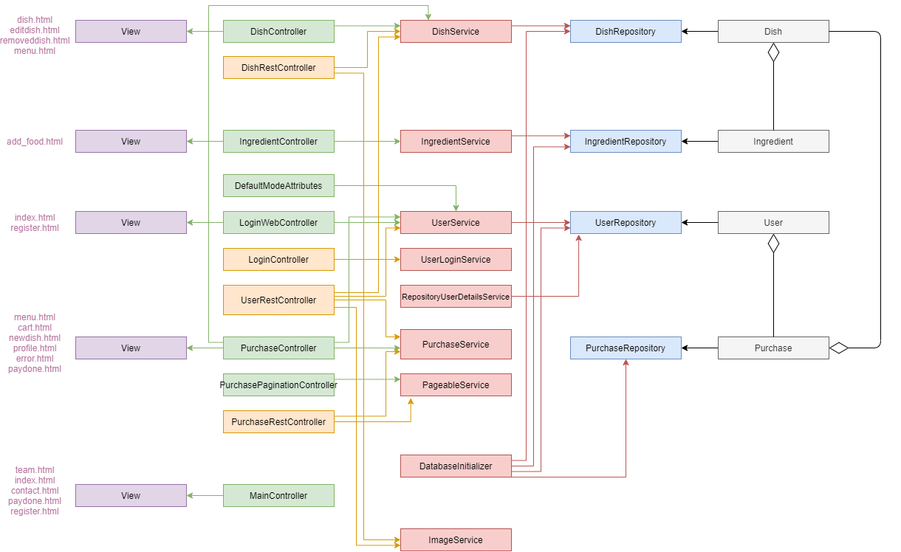

# Virtus Fitness - Gym Management System

## 👥 Team Members
| Name and Surnames | URJC Email | GitHub Username |
|:--- |:--- |:--- |
| Jorge Rodríguez Lázaro | j.rodriguezl.2023@alumnos.urjc.es | jorgeRL05 |
| Miguel Rey Carballo | m.rey.2024@alumnos.urjc.es | Miguelreey |
| Pablo Valdés Colomo | p.valdes.2023@alumnos.urjc.es | Pablo Colomo |

---

## 🎭 **Preparation: Project Definition**

### **Theme Description**
Virtus Fitness is a comprehensive management platform for sports centers and high-performance gyms. It belongs to the health and wellness sector. The primary value it provides is the ability for users to self-manage their training through class bookings and access to personalized training plans, facilitating organization for both the client and the center administrator.

### **Entities**
The following are the 4 main entities managed by the application and their relationships:

1. **User (Usuario)**: Manages credentials, profile data, and access roles.
2. **Workout Class (Clase)**: Represents the sessions offered (e.g., CrossFit, Yoga), including description and capacity.
3. **Booking (Reserva)**: An entity that links a User with a specific Class.
4. **Class Coment(Comentario de clase)**: Allows a User to leave a comment or feedback on a specific Class, enabling users to share their experience or opinion about the session.

**Relationships between entities:**
- **User - Booking**: A user can have multiple bookings for different classes (1:N).
- **Workout Class - Booking**: A class can have multiple bookings from different users until capacity is reached (1:N).
- **User - Training Plan**: A registered user has a personalized plan assigned, and each plan belongs to one user (1:1).
- **Admin - Class/Plan**: The administrator manages (CRUD) all classes and training plans.

### **User Permissions**
Description of the permissions for each user type and their data ownership:

* **Anonymous User**:
  - Permissions: Browsing the class catalog, viewing schedules, and registration.
  - Ownership: Does not own any entity.

* **Registered User**:
  - Permissions: Profile management, class booking/cancellation, and leaving comments on classes attended.
  - Ownership: Owns their own **Bookings**, their **User Profile**, and their **Class Comments**.

* **Administrator**:
  - Permissions: Full management of classes and users (CRUD). Access to global statistics.
  - Ownership: Owns the **Workout Classes** within the system.
### **Images**
Entities that will have one or more associated images:

- **User:** One profile image (avatar) per user.
- **Workout Class:** Descriptive images for each activity type.

### **Charts**
Information to be displayed using charts:
- **Chart**: New User Growth - Line Chart (for administrative use).

### **Complementary Technology**
Complementary technology to be implemented:

- **PDF Generation**: The system will use the **iText** library to automatically generate booking receipts in PDF format for users.

### **Advanced Algorithm or Query**
Advanced functionality to be implemented:

- **Algorithm/Query**: Dynamic Capacity Management and Waiting List Priority.
- **Description**: A real-time algorithm that validates class capacity. If full, it manages a waiting list prioritizing users based on their seniority and previous attendance rate.

---

## 🛠 **Part 1: Web Layout with HTML and CSS**

### **Navigation Diagram**


> Anonymous users can access public areas, while registered users gain access to their personal dashboard and booking management after logging in.

### **Screenshots and Page Descriptions**

#### **1. Home Page**


> Main landing page of Virtus Fitness where users can discover the gym, view featured training classes and quickly access login or registration to start booking sessions.


#### **2. About Page**


> Informational page describing Virtus Fitness, its philosophy, training approach and mission of promoting a healthy and active lifestyle through structured workouts.


#### **3. Classes Page**


> Page displaying all the available training classes offered by Virtus Fitness, allowing users to explore different workouts such as strength, cardio or functional training.


#### **4. Schedule Page**


> Weekly timetable showing when each training class takes place, helping users easily plan their workouts and select the sessions that best fit their availability.


#### **5. Prices Page**


> Page presenting the membership plans and pricing options available at Virtus Fitness, allowing users to compare subscriptions and choose the one that suits their training needs.


#### **6. Contact Page**


> Contact page where users can send inquiries to the Virtus Fitness team through a form and access essential information about the gym and its services.


#### **7. Login Page**


> Secure authentication page where registered users can log into their Virtus Fitness account to access the platform and manage their class bookings.


#### **8. Register Page**


> Registration page allowing new users to create a Virtus Fitness account in order to book classes, manage their schedule and access gym services online.


#### **9. Admin Page**


> Main administration dashboard providing an overview of the system, where administrators can monitor activity and manage the platform’s core functionalities.


#### **10. Admin Classes Page**


> Administrative interface used to manage gym classes, allowing administrators to create, edit or remove training sessions available to users.


#### **11. Admin Users Page**


> Administration panel section dedicated to user management, where administrators can view registered members and control access to the platform.


### **Member Participation in Part 1**

#### **Jorge Rodríguez Lázaro**
Developed HTML and CSS layouts for the "About Us" and "Schedules" pages.
| No. | Commits | Files |
|:---:|:---:|:---:|
| 1 | [Add about.html with initial content](https://github.com/CodeURJC-SSDD-2025-26/practica-ssdd-2025-26-grupo-8/commit/c24f26625f17fe8ea97d6fd00f3484b42c5fc41e) | [about.html](https://github.com/CodeURJC-SSDD-2025-26/practica-ssdd-2025-26-grupo-8/blob/main/about.html) |
| 2 | [Refactor schedule.html structure and add styles](https://github.com/CodeURJC-SSDD-2025-26/practica-ssdd-2025-26-grupo-8/commit/96bc8b9a8f3cbbe10e6d47b3c019b708e1df2e85) | [schedule.html](https://github.com/CodeURJC-SSDD-2025-26/practica-ssdd-2025-26-grupo-8/blob/main/schedule.html) |
| 3 | [Add files via upload (about.css)](https://github.com/CodeURJC-SSDD-2025-26/practica-ssdd-2025-26-grupo-8/tree/main/assets/img) | [assets/img/](https://github.com/CodeURJC-SSDD-2025-26/practica-ssdd-2025-26-grupo-8/tree/main/assets/img) |
| 4 | [Add files via upload (schedule.css)](https://github.com/CodeURJC-SSDD-2025-26/practica-ssdd-2025-26-grupo-8/tree/main/assets/img) | [assets/img/](https://github.com/CodeURJC-SSDD-2025-26/practica-ssdd-2025-26-grupo-8/tree/main/assets/img) |
| 5 | [Add navbar, hero section, and footer to about.html](https://github.com/CodeURJC-SSDD-2025-26/practica-ssdd-2025-26-grupo-8/commit/64c92fbfa36aa9c401d75919866c32d0b1bf9eaa) | [about.html](https://github.com/CodeURJC-SSDD-2025-26/practica-ssdd-2025-26-grupo-8/blob/main/about.html) |
| 6 | [Add schedule layout and activity details](https://github.com/CodeURJC-SSDD-2025-26/practica-ssdd-2025-26-grupo-8/commit/968c2857dbb0fa7720567b9330e7c6e17fa8e3f3) | [schedule.html](https://github.com/CodeURJC-SSDD-2025-26/practica-ssdd-2025-26-grupo-8/blob/main/schedule.html) |

---

#### **Miguel Rey Carballo**
Responsible for user profile design and navigation logic between roles.

| No. | Commits | Files |
|:---:|:---:|:---:|
| 1 | [complete redesign of the main page](https://github.com/CodeURJC-SSDD-2025-26/practica-ssdd-2025-26-grupo-8/commit/5114ec5982d8a0db33e2ca087336a11e5fcc0270) | [index.html](https://github.com/CodeURJC-SSDD-2025-26/practica-ssdd-2025-26-grupo-8/blob/main/index.html) |
| 2 | [complete redesign of global stylesheet](https://github.com/CodeURJC-SSDD-2025-26/practica-ssdd-2025-26-grupo-8/commit/5114ec5982d8a0db33e2ca087336a11e5fcc0270) | [styles.css](https://github.com/CodeURJC-SSDD-2025-26/practica-ssdd-2025-26-grupo-8/blob/main/css/styles.css) |
| 3 | [complete rewrite of main JavaScript file](https://github.com/CodeURJC-SSDD-2025-26/practica-ssdd-2025-26-grupo-8/commit/8728afb75e927b44846aaacbee8d20497cd9d04e) | [main.js](https://github.com/CodeURJC-SSDD-2025-26/practica-ssdd-2025-26-grupo-8/blob/main/js/main.js) |
| 4 | [created register dedicated page](https://github.com/CodeURJC-SSDD-2025-26/practica-ssdd-2025-26-grupo-8/commit/933b4568df652ded982bccdaaa8e8b7a2c22bcb0) | [register.html](https://github.com/CodeURJC-SSDD-2025-26/practica-ssdd-2025-26-grupo-8/blob/main/register.html) |
| 5 | [created register dedicated page](https://github.com/CodeURJC-SSDD-2025-26/practica-ssdd-2025-26-grupo-8/commit/933b4568df652ded982bccdaaa8e8b7a2c22bcb0) | [login.html](https://github.com/CodeURJC-SSDD-2025-26/practica-ssdd-2025-26-grupo-8/blob/main/login.html) |
| 6 | [created register dedicated js](https://github.com/CodeURJC-SSDD-2025-26/practica-ssdd-2025-26-grupo-8/commit/6b285e02a628e7d6ed9aa29b12b4118c1b88d646) | [register.js](https://github.com/CodeURJC-SSDD-2025-26/practica-ssdd-2025-26-grupo-8/blob/main/js/register.js) |
| 7 | [created login dedicated js](https://github.com/CodeURJC-SSDD-2025-26/practica-ssdd-2025-26-grupo-8/commit/6b285e02a628e7d6ed9aa29b12b4118c1b88d646) | [login.js](https://github.com/CodeURJC-SSDD-2025-26/practica-ssdd-2025-26-grupo-8/blob/main/js/login.js) |

#### **Pablo Valdés Colomo**
Responsible for administrative dashboard layouts and chart system design.

| No. | Commits | Files |
|:---:|:---:|:---:|
| 1 | [Add complete classes.html page structure and content](https://github.com/CodeURJC-SSDD-2025-26/ssdd-2025-26-project-base/commit/7ed1164a301a90f775e6b8e21fa6218016345eae) | [classes.html](https://github.com/CodeURJC-SSDD-2025-26/practica-ssdd-2025-26-grupo-8/blob/main/classes.html) |
| 2 | [Add styles for classes page](https://github.com/CodeURJC-SSDD-2025-26/ssdd-2025-26-project-base/commit/28e1d5caef456527a8741047847c6ef2d87ccc41) | [classes.css](https://github.com/CodeURJC-SSDD-2025-26/practica-ssdd-2025-26-grupo-8/blob/main/css/classes.css) |
| 3 | [Add classes.js with page-specific functionality](https://github.com/CodeURJC-SSDD-2025-26/ssdd-2025-26-project-base/commit/c5ead0ceea4f79608a431717cdabf854c18cec12) | [classes.js](https://github.com/CodeURJC-SSDD-2025-26/practica-ssdd-2025-26-grupo-8/blob/main/js/classes.js) |
| 4 | [Implement boxeo.html page structure](https://github.com/CodeURJC-SSDD-2025-26/ssdd-2025-26-project-base/commit/d11ca8fdfecd25a1df80964e4cc51a124792a810) | [boxeo.html](https://github.com/CodeURJC-SSDD-2025-26/practica-ssdd-2025-26-grupo-8/blob/main/boxeo.html) |
| 5 | [Add pricing.html page](https://github.com/CodeURJC-SSDD-2025-26/ssdd-2025-26-project-base/commit/c5ead0ceea4f79608a431717cdabf854c18cec12) | [pricing.html](https://github.com/CodeURJC-SSDD-2025-26/practica-ssdd-2025-26-grupo-8/blob/main/pricing.html) |
| 6 | [Add admin.html page](https://github.com/CodeURJC-SSDD-2025-26/ssdd-2025-26-project-base/commit/a4520395a903af4b6d61b21cd6b15334aa14e340) | [admin.html](https://github.com/CodeURJC-SSDD-2025-26/practica-ssdd-2025-26-grupo-8/blob/main/admin.html) |

## 🛠 **Práctica 2: Web con HTML generado en servidor**

### **Navegación y Capturas de Pantalla**

#### **Diagrama de Navegación**

El siguiente diagrama describe el flujo de navegación de la aplicación web VirtusFitness, diferenciando las rutas accesibles según el rol del usuario.

```
┌─────────────────────────────────────────────────────────────┐
│                     USUARIO ANÓNIMO                         │
│                                                             │
│   /  (Home)                                                 │
│    ├── /classes          → Lista de clases activas          │
│    │     └── /classes/{id}   → Detalle de clase             │
│    ├── /schedule         → Horario de clases                │
│    ├── /pricing          → Planes y precios                 │
│    ├── /about            → Sobre nosotros                   │
│    ├── /contact          → Contacto                         │
│    ├── /login            → Formulario de login              │
│    └── /register         → Formulario de registro           │
└─────────────────────────────────────────────────────────────┘

┌─────────────────────────────────────────────────────────────┐
│                   USUARIO AUTENTICADO                       │
│                                                             │
│   Todo lo anterior, más:                                    │
│    ├── /profile                → Ver perfil y reservas      │
│    │     └── /profile/edit     → Editar perfil              │
│    ├── /bookings/new           → Crear reserva              │
│    ├── /bookings/{id}/cancel   → Cancelar reserva           │
│    └── /classes/{id}/reviews   → Publicar reseña            │
└─────────────────────────────────────────────────────────────┘

┌─────────────────────────────────────────────────────────────┐
│                   ADMINISTRADOR (ROLE_ADMIN)                │
│                                                             │
│   Todo lo anterior, más:                                    │
│    └── /admin                        → Panel de control     │
│          ├── /admin/classes          → Gestión de clases    │
│          │     ├── /admin/classes/new          → Nueva clase │
│          │     ├── /admin/classes/{id}/edit    → Editar      │
│          │     ├── /admin/classes/save         → Guardar     │
│          │     └── /admin/classes/{id}/delete  → Eliminar    │
│          └── /admin/users            → Gestión de usuarios  │
│                ├── /admin/users/{id}           → Ver perfil  │
│                └── /admin/users/{id}/delete    → Eliminar    │
└─────────────────────────────────────────────────────────────┘
```

### **Instrucciones de Ejecución**

#### **Requisitos Previos**
- **Java**: versión 21 o superior
- **Maven**: versión 3.8 o superior
- **MySQL**: versión 8.0 o superior
- **Git**: para clonar el repositorio

#### **Pasos para ejecutar la aplicación**

1. **Clonar el repositorio**
   ```bash
   git clone https://github.com/[usuario]/virtusfitness.git
   cd virtusfitness
   ```

2. **Crear la base de datos MySQL**
   ```sql
   CREATE DATABASE virtusdb CHARACTER SET utf8mb4 COLLATE utf8mb4_unicode_ci;
   ```

3. **Configurar credenciales de base de datos** (si difieren del default)
   - Editar `app-service/src/main/resources/application.properties`
   - Ajustar `spring.datasource.username` y `spring.datasource.password`

4. **Compilar y ejecutar con Maven**
   ```bash
   cd app-service
   mvn spring-boot:run
   ```

5. **Acceder a la aplicación**
   - Abrir el navegador en: `https://localhost:8443`
   - Aceptar el certificado autofirmado (advertencia de seguridad esperada)
   - Los datos de ejemplo se insertan automáticamente al primer arranque

#### **Credenciales de prueba**
| Rol | Email | Contraseña |
|:---|:---|:---|
| Administrador | admin@virtusfitness.com | Admin1234! |
| Usuario registrado | maria@email.com | User1234! |
| Usuario registrado | carlos@email.com | User1234! |

### **Diagrama de Entidades de Base de Datos**


### Relaciones

| Relación                        | Cardinalidad | Descripción                              |
|---------------------------------|-------------|------------------------------------------|
| User → Booking                  | 1:N          | Un usuario puede tener múltiples reservas |
| FitnessClass → Booking          | 1:N          | Una clase puede tener múltiples reservas  |
| User → Review                   | 1:N          | Un usuario puede dejar múltiples reseñas  |
| FitnessClass → Review           | 1:N          | Una clase puede tener múltiples reseñas   |

### **Diagrama de Clases y Templates**


### **Participación de Miembros en la Práctica 2**

#### **Jorge Rodríguez Lázaro**

Responsable de la seguridad de la aplicación, gestión de usuarios, sistema de reservas con lista de espera y tecnología extra PDF. Implementó Spring Security con control de acceso por rol, el flujo de autenticación (login/register), el perfil de usuario y el algoritmo dinámico de gestión de capacidad con prioridad en lista de espera.

| Nº    | Commits      | Files      |
|:------------: |:------------:| :------------:|
| 1 | [Add PDF generation service for booking receipts using iText](https://github.com/CodeURJC-SSDD-2025-26/practica-ssdd-2025-26-grupo-8/commit/8f88785fda0a8ffe045cc343716e612999581a95) | [PdfService.java](app-service/src/main/java/es/urjc/virtusfitness/service/PdfService.java) |
| 2 | [Implement booking service with dynamic waiting list priority algorithm](https://github.com/CodeURJC-SSDD-2025-26/practica-ssdd-2025-26-grupo-8/commit/a5e8201fb75e64819ba4cf9404a7cc4d333c145c) | [BookingService.java](app-service/src/main/java/es/urjc/virtusfitness/service/BookingService.java) |
| 3 | [Add booking repository with waiting list and attendance rate queries](https://github.com/CodeURJC-SSDD-2025-26/practica-ssdd-2025-26-grupo-8/commit/2f76770f25f95dcfd0655b811af85c98869d4b2e) | [BookingRepository.java](app-service/src/main/java/es/urjc/virtusfitness/repository/BookingRepository.java) |
| 4 | [Add profile page with bookings history and edit form](https://github.com/CodeURJC-SSDD-2025-26/practica-ssdd-2025-26-grupo-8/commit/d1cf4b22542a938ba0bfd371f13b5f3e4c7aa041) | [profile.html](app-service/src/main/resources/templates/profile.mustache) |
| 5 | [Add profile controller with view and edit endpoints](https://github.com/CodeURJC-SSDD-2025-26/practica-ssdd-2025-26-grupo-8/commit/4e8adb6ff7df5e0fd7f35f2e426e4f7a74771f5e) | [ProfileController.java](app-service/src/main/java/es/urjc/virtusfitness/controller/ProfileController.java) | 


---

#### **Miguel Rey Carballo**

Responsable del diseño de las plantillas Thymeleaf principales (home, clases, horarios, precios), el inicializador de datos de ejemplo y la integración del frontend con el backend mediante los modelos y los controladores de vistas públicas.

| Nº    | Commits      | Files      |
|:------------: |:------------:| :------------:|
|1| [Add model classes: User, Booking, Review](https://github.com/CodeURJC-SSDD-2025-26/practica-ssdd-2025-26-grupo-8/commit/689fb1a)  | [User.java](app-service/src/main/java/es/urjc/virtusfitness/model/User.java), [Booking.java](app-service/src/main/java/es/urjc/virtusfitness/model/Booking.java), [Review.java](app-service/src/main/java/es/urjc/virtusfitness/model/Review.java)   |
|2| [Add controllers: Home, Class, Review](https://github.com/CodeURJC-SSDD-2025-26/practica-ssdd-2025-26-grupo-8/commit/427689e)  | [HomeController.java](app-service/src/main/java/es/urjc/virtusfitness/controller/HomeController.java), [ClassController.java](app-service/src/main/java/es/urjc/virtusfitness/controller/ClassController.java), [ReviewController.java](app-service/src/main/java/es/urjc/virtusfitness/controller/ReviewController.java)   |
|3| [Add DataInitializer for sample data loading](https://github.com/CodeURJC-SSDD-2025-26/practica-ssdd-2025-26-grupo-8/commit/0d57af4)  | [DataInitializer.java](app-service/src/main/java/es/urjc/virtusfitness/init/DataInitializer.java)   |
|4| [Add Thymeleaf templates: index, classes, class-detail, schedule, pricing, about, contact](https://github.com/CodeURJC-SSDD-2025-26/practica-ssdd-2025-26-grupo-8/commit/6d6009b)  | [index.html](app-service/src/main/resources/templates/index.html), [classes.html](app-service/src/main/resources/templates/classes.html), [class-detail.html](app-service/src/main/resources/templates/class-detail.html), [schedule.html](app-service/src/main/resources/templates/schedule.html), [pricing.html](app-service/src/main/resources/templates/pricing.html), [about.html](app-service/src/main/resources/templates/about.html), [contact.html](app-service/src/main/resources/templates/contact.html)   |
|5| [Add VirtusFitnessApplication main class and ImageController](https://github.com/CodeURJC-SSDD-2025-26/practica-ssdd-2025-26-grupo-8/commit/39039af)  | [VirtusFitnessApplication.java](app-service/src/main/java/es/urjc/virtusfitness/VirtusFitnessApplication.java), [ImageController.java](app-service/src/main/java/es/urjc/virtusfitness/controller/ImageController.java)   |


---

#### **Pablo Valdés Colomo**

Responsable del panel de administración completo (gestión de clases y usuarios), el controlador de clases públicas, el sistema de reseñas y las páginas de error personalizadas. Implementó el CRUD completo de clases desde el panel admin con carga de imágenes a base de datos.

| Nº    | Commits      | Files      |
|:------------: |:------------:| :------------:|
|1| [Add fitness class model, repository, service, admin controllers and templates](https://github.com/CodeURJC-SSDD-2025-26/practica-ssdd-2025-26-grupo-8/commit/45f7746)  | [AdminController.java](app-service/src/main/java/es/urjc/virtusfitness/controller/AdminController.java), [FitnessClass.java](app-service/src/main/java/es/urjc/virtusfitness/model/FitnessClass.java), [FitnessClassRepository.java](app-service/src/main/java/es/urjc/virtusfitness/repository/FitnessClassRepository.java), [FitnessClassService.java](app-service/src/main/java/es/urjc/virtusfitness/service/FitnessClassService.java), [index.html](app-service/src/main/resources/templates/admin/index.html), [classes.html](app-service/src/main/resources/templates/admin/classes.html), [users.html](app-service/src/main/resources/templates/admin/users.html), [user-detail.html](app-service/src/main/resources/templates/admin/user-detail.html), [class-form.html](app-service/src/main/resources/templates/class-form.html), [404.html](app-service/src/main/resources/templates/error/404.html), [500.html](app-service/src/main/resources/templates/error/500.html)   |


---
## 🛠 **Práctica 3: API REST, docker y despliegue**

### **Documentación de la API REST**

#### **Especificación OpenAPI**
📄 **[Especificación OpenAPI (YAML)](api-docs/api-docs.yaml)**

#### **Documentación HTML**
📖 **[Documentación API REST (HTML)](https://raw.githack.com/Miguelreey/GRUPO-8-DISTRIBUIDOS/practica-3/api-docs/api-docs.html)**

> Documentación generada automáticamente con SpringDoc a partir de las anotaciones `@Tag`, `@Operation` y `@ApiResponse` en el código Java. También disponible en tiempo de ejecución en `/swagger-ui.html`.

---

### **Diagrama de Clases Actualizado (Práctica 3)**

Diagrama actualizado con los nuevos `@RestController` y los `@Service` compartidos:



---

### **Diagrama de Servicios**

Comunicación entre `app-service` y `utility-service`:

```
┌─────────────────────────────────────┐        ┌──────────────────────────────┐
│           app-service               │        │       utility-service        │
│           :8443 (HTTPS)             │        │       :8080 (HTTP)           │
│                                     │        │                              │
│  Web @Controller  ──┐               │        │  POST /api/v1/pdfs/          │
│                     ├──> @Service ──┼──HTTP──┤    booking-receipts          │
│  REST @RestController─┘             │        │                              │
│                                     │  JSON  │  Genera PDF con OpenPDF      │
│  UtilityServiceClient ──────────────┼──────> │  y lo devuelve como          │
│  (RestClient de Spring 6)           │  <──── │  application/pdf             │
└─────────────────────────────────────┘        └──────────────────────────────┘
                │
                │ JDBC
                ▼
        ┌──────────────┐
        │    MySQL     │
        │   :3306      │
        └──────────────┘
```

---

### **Instrucciones de Ejecución con Docker Compose**

#### **Opción A — Usando el OCI Artifact publicado en DockerHub (recomendado)**

Solo necesitas Docker instalado. Sin clonar el repositorio:

```bash
# 1. Instalar oras CLI (https://oras.land)
# 2. Descargar el docker-compose desde DockerHub
oras pull registry-1.docker.io/pablocolomo/virtus-fitness-compose:latest

# 3. Arrancar los 3 servicios
docker compose -f docker_compose.yml up
```

La aplicación estará disponible en `https://localhost:8443`

#### **Opción B — Clonando el repositorio**

```bash
git clone https://github.com/Miguelreey/GRUPO-8-DISTRIBUIDOS.git
cd GRUPO-8-DISTRIBUIDOS
docker compose -f docker/docker_compose.yml up
```

---

### **Instrucciones para Construir y Publicar la Imagen Docker**

#### **Requisitos:**
- Docker instalado y en ejecución

#### **0. Regenerar la documentación OpenAPI (opcional)**
```bash
cd app-service
mvn verify "-Djavax.net.ssl.trustStore=src/main/resources/keystore.jks" \
           "-Djavax.net.ssl.trustStorePassword=password"
```
Genera `api-docs/api-docs.yaml` automáticamente.

#### **1. Construir las imágenes localmente**
```bash
bash docker/create_image.sh
```
Genera las imágenes `virtus-fitness/app-service:latest` y `virtus-fitness/utility-service:latest`.

#### **2. Publicar las imágenes en DockerHub**
```bash
DOCKERHUB_USERNAME=tu_usuario bash docker/publish_image.sh
```

#### **3. Publicar el docker-compose como OCI Artifact**
```bash
# Requiere oras CLI (https://oras.land)
DOCKERHUB_USERNAME=tu_usuario bash docker/publish_docker-compose.sh
```

Las imágenes publicadas están disponibles en:
- `pablocolomo/app-service:latest`
- `pablocolomo/utility-service:latest`
- `pablocolomo/virtus-fitness-compose:latest` (OCI Artifact)

---

### **Credenciales de Usuarios de Ejemplo**

| Rol | Email | Contraseña |
|:---|:---|:---|
| Administrador | admin@virtusfitness.com | Admin1234! |
| Usuario Registrado | maria.garcia@email.com | User1234! |
| Usuario Registrado | carlos.ruiz@email.com | User1234! |

---

### **Participación de Miembros en la Práctica 3**

#### **Jorge Rodríguez Lázaro**

Responsable de la seguridad de la API REST con JWT, el microservicio utility-service de generación de PDFs y la comunicación entre servicios mediante RestClient.

| Nº | Commits | Files |
|:---:|:---:|:---:|
| 1 | Add JWT authentication (SecurityConfig API chain) | [SecurityConfig.java](app-service/src/main/java/es/urjc/virtusfitness/security/SecurityConfig.java) |
| 2 | Add BookingsRestController with OpenAPI annotations | [BookingsRestController.java](app-service/src/main/java/es/urjc/virtusfitness/rest/BookingsRestController.java) |
| 3 | Add Booking DTOs and mapper | [BookingCreateDto.java](app-service/src/main/java/es/urjc/virtusfitness/dto/BookingCreateDto.java), [BookingDto.java](app-service/src/main/java/es/urjc/virtusfitness/dto/BookingDto.java), [BookingMapper.java](app-service/src/main/java/es/urjc/virtusfitness/mapper/BookingMapper.java) |
| 4 | Add utility-service (PDF microservice) | [PdfRestController.java](utility-service/src/main/java/es/urjc/virtusfitness/utility/pdf/PdfRestController.java), [PdfService.java](utility-service/src/main/java/es/urjc/virtusfitness/utility/pdf/PdfService.java) |
| 5 | Add UtilityServiceClient for inter-service HTTP communication | [UtilityServiceClient.java](app-service/src/main/java/es/urjc/virtusfitness/client/UtilityServiceClient.java), [UtilityServiceException.java](app-service/src/main/java/es/urjc/virtusfitness/client/UtilityServiceException.java) |

---

#### **Miguel Rey Carballo**

Responsable de los endpoints REST de clases y reseñas con paginación y filtrado, los DTOs y mappers correspondientes, y la infraestructura Docker Compose.

| Nº | Commits | Files |
|:---:|:---:|:---:|
| 1 | Add ClassesRestController with category filter and pagination | [ClassesRestController.java](app-service/src/main/java/es/urjc/virtusfitness/rest/ClassesRestController.java) |
| 2 | Add FitnessClass DTOs and mapper | [FitnessClassDto.java](app-service/src/main/java/es/urjc/virtusfitness/dto/FitnessClassDto.java), [FitnessClassCreateDto.java](app-service/src/main/java/es/urjc/virtusfitness/dto/FitnessClassCreateDto.java), [FitnessClassMapper.java](app-service/src/main/java/es/urjc/virtusfitness/mapper/FitnessClassMapper.java) |
| 3 | Add ReviewsRestController with OpenAPI annotations | [ReviewsRestController.java](app-service/src/main/java/es/urjc/virtusfitness/rest/ReviewsRestController.java) |
| 4 | Add Review DTOs, mapper and PageResponse | [ReviewDto.java](app-service/src/main/java/es/urjc/virtusfitness/dto/ReviewDto.java), [ReviewMapper.java](app-service/src/main/java/es/urjc/virtusfitness/mapper/ReviewMapper.java), [PageResponse.java](app-service/src/main/java/es/urjc/virtusfitness/dto/PageResponse.java) |
| 5 | Add Docker Compose and build/publish scripts | [docker_compose.yml](docker/docker_compose.yml), [create_image.sh](docker/create_image.sh), [publish_image.sh](docker/publish_image.sh) |

---

#### **Pablo Valdés Colomo**

Responsable de los endpoints REST de usuarios, los Dockerfiles multi-stage, la colección Postman y la documentación OpenAPI/Swagger.

| Nº | Commits | Files |
|:---:|:---:|:---:|
| 1 | Add UsersRestController with OpenAPI annotations | [UsersRestController.java](app-service/src/main/java/es/urjc/virtusfitness/rest/UsersRestController.java) |
| 2 | Add User DTOs and mapper | [UserDto.java](app-service/src/main/java/es/urjc/virtusfitness/dto/UserDto.java), [UserCreateDto.java](app-service/src/main/java/es/urjc/virtusfitness/dto/UserCreateDto.java), [UserUpdateDto.java](app-service/src/main/java/es/urjc/virtusfitness/dto/UserUpdateDto.java), [UserMapper.java](app-service/src/main/java/es/urjc/virtusfitness/mapper/UserMapper.java) |
| 3 | Add multi-stage Dockerfiles for app-service and utility-service | [app-service.Dockerfile](docker/app-service.Dockerfile), [utility-service.Dockerfile](docker/utility-service.Dockerfile) |
| 4 | Add Postman collection with {{baseUrl}} variable | [api.postman_collection.json](api.postman_collection.json) |
| 5 | Add OpenAPI/Swagger configuration and api-docs files | [api-docs.yaml](api-docs/api-docs.yaml), [api-docs.html](api-docs/api-docs.html) |

---
